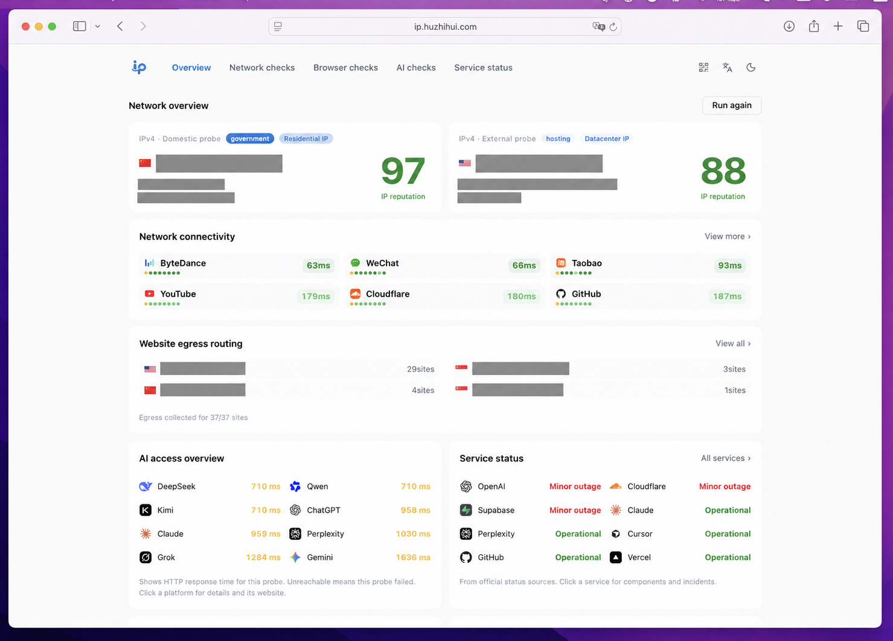
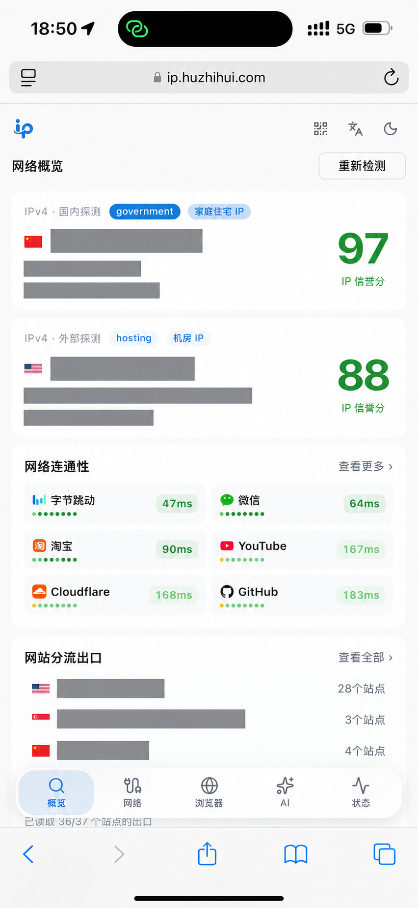

# One IP

<p align="left">
  
  
  
  
  
  
  
  
  
  
  
  
</p>

A toolbox for IP lookups, network diagnostics, browser checks and AI service status.

[中文](README.md) · **English**

[Live demo](https://ip.huzhihui.com/) · [GitHub](https://github.com/zhihui-hu/one-ip)

Click the button below for one-click deployment to Cloudflare.

[](https://deploy.workers.cloudflare.com/?url=https%3A%2F%2Fgithub.com%2Fzhihui-hu%2Fone-ip)

## Terminal and API

After deploying this version, use `GET /api/ip/health` without an API key:

```bash
# Current request's public egress IP, readable terminal output
curl -fsS 'https://ip.huzhihui.com/api/ip/health?format=text'
# JSON (default)
curl -fsS 'https://ip.huzhihui.com/api/ip/health'
# Explicit public IPv4 or IPv6
curl -fsS 'https://ip.huzhihui.com/api/ip/health?ip=1.1.1.1'
curl -fsS 'https://ip.huzhihui.com/api/ip/health?ip=2606:4700:4700::1111&format=text'
```

Replace the domain for your deployment. Local development uses `http://127.0.0.1:8787` and requires `ip`. Without `ip`, the API uses the caller address identified by Cloudflare; a proxy changes that egress address.

Returns `ip`, `source`, `checked_at`, `score`, `status`, location, ISP, ASN and `flags` (residential, datacenter, mobile, VPN, proxy, Tor, crawler, abuser). The trust score ranges from 0 to 100, higher is better. Matching the UI, 75–100 is `good`, 45–74 is `moderate`, below 45 is `poor`. Missing or invalid scores yield `score: null` and `status: "unknown"`; missing flags are `null`, not `false`.

`format` accepts `json` (default) or `text`. Errors always use JSON `{ "error": "…" }`: 400 for invalid input, 429 for rate limits, 503 when the caller IP is unavailable, and 502 for provider failures or mismatched IPs. Existing API rate limits apply; responses are not cached. This reports third-party IP reputation, not terminal speed tests, browser diagnostics or AI account availability.

## Deploy to Cloudflare

1. [Fork this project](https://github.com/zhihui-hu/one-ip/fork) into your GitHub account.
2. Open the [Cloudflare dashboard](https://dash.cloudflare.com/), go to **Workers & Pages**, create a Worker and choose to import a Git repository.
3. Connect GitHub, select your `one-ip` fork and set the production branch to `main`.
4. Set the build command to `pnpm build` and the deploy command to `pnpm deploy`. Use Node.js 24 and pnpm 10.32.1. Keep the default root directory.
5. Deploy and open the assigned `workers.dev` address. Use the Worker settings to connect a custom domain.

The project uses **Cloudflare Workers with Static Assets**. The `/api/*` routes need a Worker. Core features require no application environment variables or API keys. See “Verification” for Turnstile and reCAPTCHA setup.

Workers Builds builds and deploys when `main` receives a commit. The button above points to the original repository. To preserve the fork relationship and update workflow, follow the steps to import your fork.

## Features

| Module                   | Features                                                                                                                                                      |
| ------------------------ | ------------------------------------------------------------------------------------------------------------------------------------------------------------- |
| Overview                 | Domestic and external IPv4 probes, location, ISP, reputation and network classifications                                                                      |
| IP details               | IPv4 / IPv6 lookups, ASN, CIDR, registration, network attributes, risk flags, maps, location comparison and related addresses, subject to source availability |
| Routing and connectivity | Compare website egress addresses, group sites by IP, measure HTTP response times over multiple samples and sort by median latency                             |
| Global Ping              | Globalping probes, region and city selection, latency, packet loss and incremental results                                                                    |
| DNS / CDN                | DNS resolver egress, CDN serving nodes and available cache metadata                                                                                           |
| WHOIS                    | RDAP records for domains, IPs and ASNs, including raw responses                                                                                               |
| Browser checks           | Environment details, FingerprintJS fingerprints, consistency checks, CreepJS modules, automation signals, permissions and WebRTC                              |
| AI access                | ChatGPT, Claude, Grok, Perplexity, Gemini, DeepSeek, Qwen and Kimi resource probes, with egress comparisons where supported                                   |
| Service status           | Official status feeds, incidents, maintenance, components and event details                                                                                   |
| Usability                | Chinese / English, light / dark themes, mobile layouts and drawers, local lookup history, QR sharing and link copying                                         |
| Optional verification    | Cloudflare Turnstile and Google reCAPTCHA v3; menu entries require complete configuration and a matching hostname                                             |

Some lookups rely on third-party services and may fail because of rate limits or CORS restrictions. HTTP timing isn't the same as ICMP Ping. IP classifications and reputation scores are references, not official decisions from AI platforms.

## Screenshots

IP addresses, detailed locations and ISP / ASN information have been redacted. Values are not live results.



<table>
  <tr><th>Mobile · Light</th><th>Mobile · Dark</th></tr>
  <tr>
    <td></td>
    <td></td>
  </tr>
</table>

## Update your fork

Click **Sync fork → Update branch** on your GitHub repository page. Review differences if you have code changes, and resolve merge conflicts.

For scheduled updates, enable `Sync upstream`:

1. Enable workflows in your fork's Actions tab.
2. Under Settings → Secrets and variables → Actions → **Variables**, add `AUTO_SYNC_UPSTREAM=true`.
3. The workflow checks for updates at 04:23 UTC each day. You can run it from the Actions page.

The workflow supports forks created from `zhihui-hu/one-ip` and requires no personal access token. It uses GitHub's `merge-upstream` API, stops on conflicts and preserves your commits. Use GitHub's Sync fork if you want to review updates.

- **Workers Builds:** connect your fork's production branch and check deployment records for synchronized commits in Cloudflare's build history.
- **GitHub Actions deployment:** the sync workflow triggers deployment when it merges updates. Pushes made with `GITHUB_TOKEN` do not trigger ordinary `push` workflows.
- If branch protection blocks a merge, use a PR.
- Enable scheduled workflows in your fork. GitHub may disable schedules after 60 days of inactivity in a public repository; use the Actions page to enable them.

References: [Syncing a fork](https://docs.github.com/en/pull-requests/how-tos/work-with-forks/syncing-a-fork), [GITHUB_TOKEN triggering behavior](https://docs.github.com/en/actions/concepts/security/github_token), [Workflow disabling rules](https://docs.github.com/en/actions/how-tos/manage-workflow-runs/disable-and-enable-workflows).

## GitHub Actions deployment (optional)

Choose Workers Builds or GitHub Actions to avoid duplicate deployments. Actions runs builds and tests by default. To enable deployment, add these settings to your repository's Actions configuration:

| Kind     | Name                    | Purpose                                              |
| -------- | ----------------------- | ---------------------------------------------------- |
| Variable | `ENABLE_CF_DEPLOY=true` | Enable deployment                                    |
| Secret   | `CLOUDFLARE_API_TOKEN`  | Worker deployment credentials for the target account |
| Secret   | `CLOUDFLARE_ACCOUNT_ID` | Target Cloudflare account ID                         |

Push to `main` or run `Build and deploy one-ip`. Deployment starts after builds and tests pass. External PRs run tests without deployment credentials. These credentials are used by CI.

## Local development and deployment

```bash
pnpm install --frozen-lockfile
pnpm worker:dev
```

Open `http://127.0.0.1:8787`. The command starts Vite and the local Worker with hot reload. The launcher sets `LOCAL_DEV=true` for the local process, with no changes to your Wrangler configuration.

```bash
pnpm build
pnpm test
pnpm lint

# Log in to Cloudflare and deploy
pnpm exec wrangler login
pnpm deploy
```

`pnpm deploy` uses the build output in `dist`; run `pnpm build` before deployment. `make deploy` updates the version, builds and deploys without a secrets file.

## Verification (optional)

Choose Turnstile or reCAPTCHA and provide a Site Key, Secret and allowed hostname. The verification entry appears when the configuration is complete and the hostname matches. Missing configuration keeps the entry hidden.

| Provider     | Settings                                                        |
| ------------ | --------------------------------------------------------------- |
| Turnstile    | `TURNSTILE_SITE_KEY`, `TURNSTILE_SECRET`, `TURNSTILE_HOSTNAMES` |
| reCAPTCHA v3 | `RECAPTCHA_SITE_KEY`, `RECAPTCHA_SECRET`, `RECAPTCHA_HOSTNAMES` |

For local development, copy the [configuration example](docs/config/challenges.env.example) to `.dev.vars` in the project root, fill in your keys and restart. Edit the existing file if present. Use comma-separated hostnames such as `example.com`, and allow those hostnames in the provider's console.

For production, enter the settings under Worker → Settings → Variables and Secrets, or run `pnpm exec wrangler secret put NAME`. To use a configuration file, copy `.secrets.example` to `.secrets.production.env`, fill it in and run:

```bash
node scripts/sync-worker-secrets.mjs production --check
node scripts/sync-worker-secrets.mjs production
```

The script uploads non-empty values, preserves existing secrets and skips missing optional files. Sensitive files are in the Git ignore list. Store secrets in Worker settings, not `VITE_*` variables. Check the `configured` fields at `/api/browser/challenges` to inspect the setup.

reCAPTCHA uses v3 score-based keys. The backend validates hostname, the `browser_check` action and score, with a passing threshold of 0.5. The v2 checkbox and Enterprise assessment API are unsupported. Production rejects localhost.

## Structure and data sources

- `src/app.css`: interface styles; `src/components/ui`: shadcn/ui components.
- `src/views`: network, browser, AI and status pages; `public/worker`: Worker APIs.
- Net.Coffee: IP details. Available fields depend on the API response.
- Globalping: global measurements; IANA / RDAP: registration records; official platform status feeds: service status.
- FingerprintJS and CreepJS: browser checks. See [vendor/browser-diagnostics](vendor/browser-diagnostics/README.md) for module details.

Issues and suggestions are welcome. Redact private information such as IPs, locations and fingerprint identifiers before sharing screenshots.
